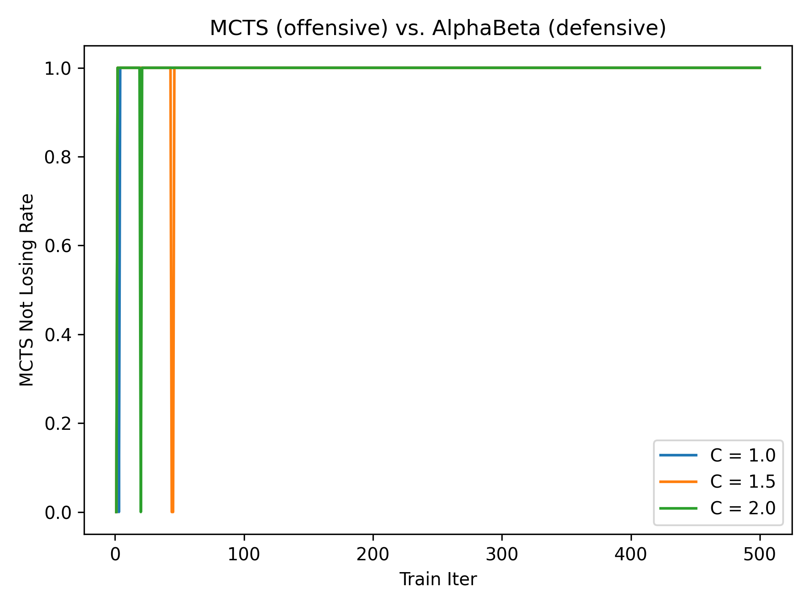
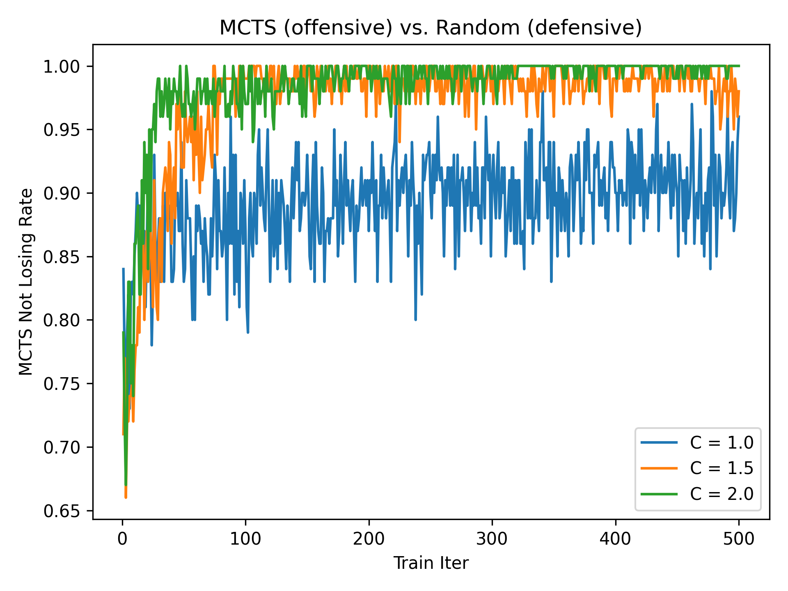
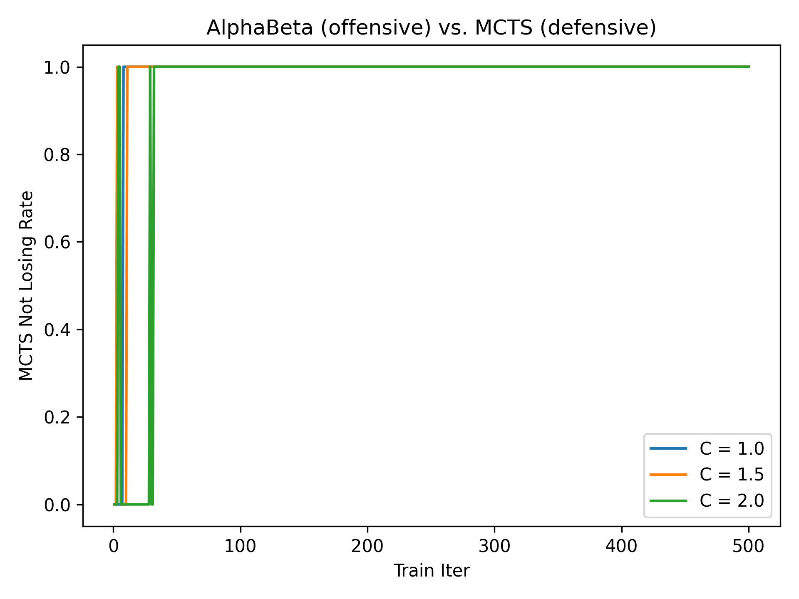
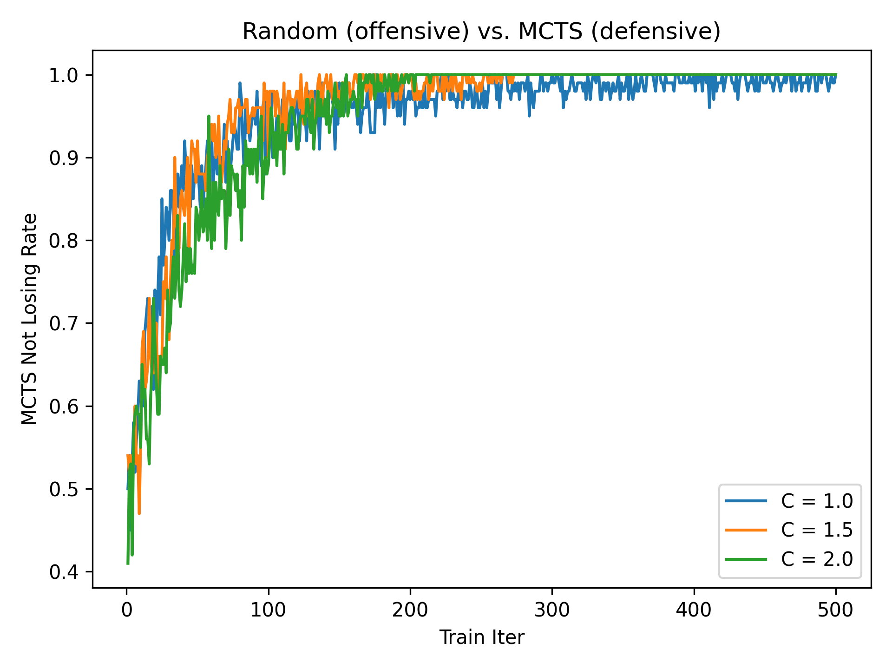

## 作业 1: 蒙特卡洛树搜索

> 2. 适当修改 `train.py`, 在 $3 \times 3$ 棋盘上完成 MCTS 算法的训练, 并使用 `eval.py` 对比 MCTS 算法与随机策略, MCTS 算法与 AlphaBeta 算法的效果.

| Player 1 | Player 2  | Player 1 Win | Player 2 Win | Draw    |
| -------- | --------- | ------------ | ------------ | ------- |
| MCTS     | Random    | 88.21%       | 5.18%        | 6.61%   |
| MCTS     | AlphaBeta | 0.00%        | 0.00%        | 100.00% |

> 3. 绘制在 $3 \times 3$ 棋盘上 MCTS 算法对阵 AlphaBeta / Random 算法随自我对弈局数的先后手不败率折线图. 要求至少使用 3 个不同的 `C` 值, 自我对弈局数至少为 500 局, 对结果做适当的分析.

| Player         | AlphaBeta                                          | Random                                       |
| -------------- | -------------------------------------------------- | -------------------------------------------- |
| MCTS offensive |  |  |
| MCTS defensive |  |  |

- 随着局数增加, 搜索树会变得越来越庞大, 节点的价值会被更准确地估计. 因此, 随着自我对弈局数的增加, MCTS 的棋力呈增强趋势.
- 本例中评估时使用的 AlphaBeta 和 MCTS 不具有随机性. 因此, 在 MCTS 的参数确定的情况下, 对局的结果也是确定的. 而 AlphaBeta 总是能够给出最优解. 因此, AlphaBeta 与 MCTS 的对局只可能出现全部平局, 或者 AlphaBeta 全胜的情况.
- 即使是成熟的 MCTS, 在面对 Random 时仍有可能输棋. 这是因为 MCTS 自我对弈时更倾向于探索 "智慧" 的操作, 即认为对手更加 "聪明". 而对于 Random 可能会采取的 "愚笨" 的一步, MCTS 可能没有进行足够的探索. 这导致 MCTS 虽千虑万虑, 但仍有一失.

> 4. 在 $3 \times 4$ 棋盘 (仍然规定三子连珠获胜) 上使用 MCTS 算法自我对弈 2000 局, 保存参数. 重新载入参数, 用 MCTS 对阵 AlphaBeta / Random 算法, 汇报先手和后手的胜率.

| Offensive | Defensive | Offensive Win | Defensive Win | Draw  |
| --------- | --------- | ------------- | ------------- | ----- |
| MCTS      | AlphaBeta | 100.00%       | 0.00%         | 0.00% |
| AlphaBeta | MCTS      | 100.00%       | 0.00%         | 0.00% |
| MCTS      | Random    | 100.00%       | 0.00%         | 0.00% |
| Random    | MCTS      | 32.94%        | 65.02%        | 2.04% |

> 1. 为什么 AlphaZero 使用了 MCTS 而不是 AlphaBeta 作为搜索主干?

- ~~AlphaBeta + Neural Networks 前人做过了~~
- MCTS 可以平均化子树内的位置评估, 而 AlphaBeta 是计算子树的极小极大值. 这样可以减少评估函数较大的偶然误差的影响.
- MCTS 可以返回每个动作的访问次数, 这些数据可以用来训练策略网络. 而 AlphaBeta 只能返回一个最佳动作, 只能用来训练价值网络.
- MCTS 更适合处理复杂的游戏, 比如围棋, 因为它可以灵活地分配搜索资源, 而 AlphaBeta 需要固定的搜索深度和剪枝策略.

> 2. AlphaZero 中使用的基于 PUCT (Polynomial Upper Confidence Tree) 的 MCTS 与我们课件中基于 UCT (Upper Confidence Tree) 的 MCTS 有什么区别?

- PUCT 在选择节点时使用了一个预测器 (predictor), 通常是一个神经网络, 来评估每个节点的价值, 而 UCT 只使用了节点的访问次数和平均奖励.
- PUCT 使用了一个多项式函数来平衡探索和利用, 而 UCT 使用了一个对数函数.
- PUCT 比 UCT 更快, 更有效地搜索了更大的空间, 并且有更高的成功率.
