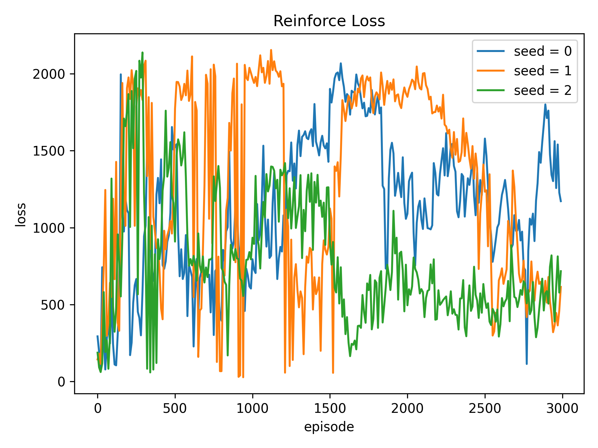
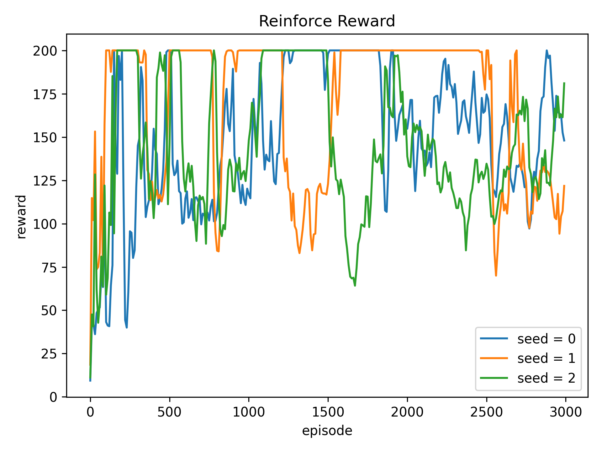

## 作业 2: 强化学习基础

### Reinforce





### 围棋的强化学习环境

#### Coverage

Detailed coverage report can be found at [Codecov](https://app.codecov.io/gh/liblaf/TinyAlphaZero/tree/main/hw2%2Fcode%2Falphazero).

```
---------- coverage: platform linux, python 3.9.16-final-0 -----------
Name                                   Stmts   Miss  Cover   Missing
--------------------------------------------------------------------
code/alphazero/GoBoard.py                150     12    92%   26-39
code/alphazero/GoGame.py                  49      2    96%   113, 120
code/alphazero/GoTest.py                  44     44     0%   1-308
code/alphazero/__init__.py                 0      0   100%
code/alphazero/tests/GoBoard_test.py      47      0   100%
code/alphazero/tests/GoGame_test.py       70      0   100%
code/alphazero/tests/__init__.py           0      0   100%
--------------------------------------------------------------------
TOTAL                                    360     58    84%
```
